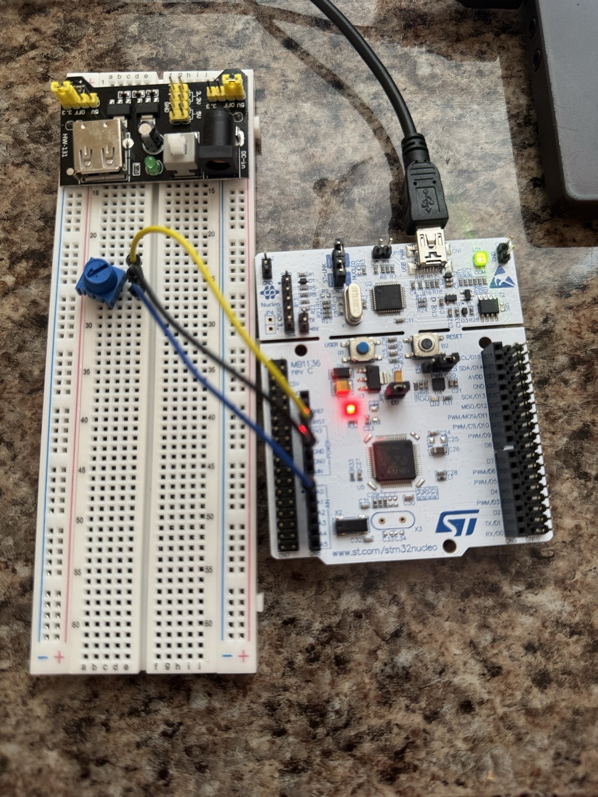
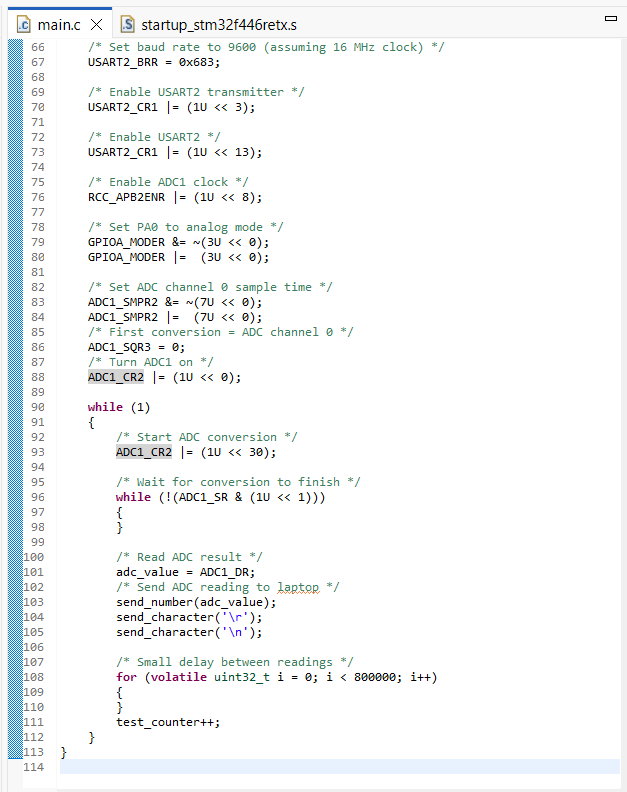
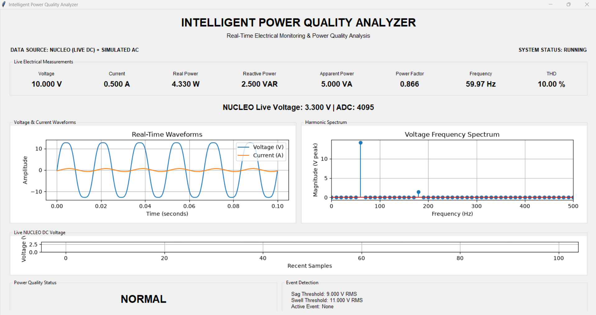
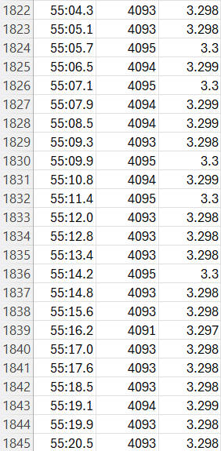

# Intelligent Power Quality Analyzer

### Embedded Systems | Electrical Engineering | Computer Engineering | Python

**Designed and Developed by Jadaya Alston**  
**Project Type:** Independent Engineering Project

---

## Project Overview

The Intelligent Power Quality Analyzer is an independently developed embedded monitoring prototype integrating an STM32 NUCLEO-F446RE microcontroller with a Python-based graphical user interface.

The system acquires real analog DC voltage measurements using the STM32's 12-bit analog-to-digital converter (ADC), transmits measurement data through UART serial communication, and displays the results through a real-time monitoring dashboard.

The software also incorporates simulated AC power-quality analysis, including voltage and current waveforms, electrical power parameters, harmonic visualization, and disturbance indicators.

This project demonstrates practical engineering experience in:

- Embedded systems development
- Microcontroller programming
- Electrical circuit implementation
- Analog-to-digital conversion
- UART serial communication
- Python software development
- Real-time data acquisition and visualization
- Engineering testing and validation
- Technical documentation

---

## Hardware Implementation

### Complete Hardware Prototype



### Hardware Components

| Component | Purpose |
|---|---|
| STM32 NUCLEO-F446RE | Microcontroller and data acquisition |
| Breadboard | Circuit prototyping |
| Potentiometer | Variable analog voltage input |
| Jumper Wires | Electrical connections |
| USB Cable | Power and serial communication |
| Windows Computer | Firmware development and monitoring |

### Circuit Design

The potentiometer generates an adjustable DC voltage between approximately 0 V and 3.3 V.

The potentiometer's output is connected to analog input PA0 on the NUCLEO.

The microcontroller samples the voltage using its 12-bit ADC, producing a digital measurement between 0 and 4095.

**ADC Voltage Conversion:**

V = (ADC Reading / 4095) × 3.3 V

### Breadboard Wiring


---

## Embedded Firmware Development

The microcontroller firmware was developed in Embedded C using STM32CubeIDE.

The implementation uses direct register-level programming to configure and control STM32 peripherals.

### Firmware Features

- ADC1 initialization and configuration
- Analog voltage acquisition through PA0
- 12-bit ADC conversion
- USART2 configuration
- UART serial transmission at 9600 baud
- Continuous measurement acquisition
- Communication with the Python monitoring application

### Firmware Source Code

[View Embedded C Firmware](firmware/main.c)

### STM32 ADC and UART Implementation



---

## Python Monitoring Dashboard

The monitoring dashboard was developed using Python and integrates real hardware measurements with simulated power-quality analysis.

### Real Hardware Features

- Live DC voltage measurements
- Real-time ADC readings
- Continuous voltage visualization
- Serial communication with the NUCLEO
- Automatic CSV data logging
- Timestamped measurement recording

### Simulated AC Analysis Features

- AC voltage and current waveforms
- RMS voltage and current
- Active, reactive, and apparent power
- Power factor
- Frequency visualization
- Harmonic spectrum
- Total harmonic distortion (THD)
- Voltage sag and swell indicators

**Important:** AC measurements and power-quality indicators are currently simulated. The physical hardware measures low-voltage DC signals only.

### Dashboard Screenshot



### Python Source Code

[View Python Monitoring Dashboard](software/dashboard_v3.py)

---

## System Architecture

The prototype integrates physical voltage acquisition, embedded firmware, serial communication, and Python-based monitoring.

```text
       VARIABLE DC VOLTAGE INPUT
          Potentiometer
             0–3.3 V
                |
                v
       STM32 NUCLEO-F446RE
           ADC1 / PA0
                |
                v
        EMBEDDED C FIRMWARE
        12-bit ADC Conversion
                |
                v
        USART2 COMMUNICATION
            9600 Baud
                |
                v
         PYTHON APPLICATION
                |
        +-------+-------+
        |       |       |
        v       v       v
      Live     ADC     CSV
     Voltage  Display Logging
        |
        v
    Real-Time Graph


     SEPARATE AC SIMULATION
                |
        +-------+-------+
        |       |       |
        v       v       v
    AC Waveforms Power  Harmonics
                |
                v
      Power-Quality Indicators
```

---

## Experimental Testing and Results

The prototype was tested using the physical NUCLEO development board, potentiometer, and Python monitoring dashboard.

The potentiometer was adjusted to vary the analog input voltage while observing the corresponding ADC readings and real-time dashboard response.

### Verified Results

| Test Parameter | Experimental Result |
|---|---|
| Microcontroller | STM32 NUCLEO-F446RE |
| ADC Resolution | 12-bit |
| ADC Range | 0–4095 |
| Input Voltage Range | Approximately 0–3.3 V |
| Minimum ADC Reading | 0 |
| Maximum ADC Reading | 4095 |
| Maximum Calculated Voltage | 3.300 V |
| UART Communication | 9600 baud |
| Live Voltage Monitoring | Successfully demonstrated |
| Real-Time Graphing | Successfully demonstrated |
| CSV Data Logging | Successfully demonstrated |
| Logged Measurements | More than 1,600 entries |

### Recorded Measurement Results



The recorded measurements demonstrate successful communication between the physical measurement circuit, STM32 firmware, and Python software.

The system responded to changes in the potentiometer position and recorded corresponding ADC values and calculated voltages.

The results verify the functional operation of the DC measurement prototype. Measurement accuracy has not been independently calibrated against a certified reference instrument.

---

## Technologies and Engineering Skills

### Embedded Systems and Hardware

- STM32 NUCLEO-F446RE
- Embedded C
- STM32 peripheral configuration
- Register-level programming
- Analog-to-digital conversion
- UART communication
- Electrical circuit prototyping
- Hardware/software integration

### Software Development

- Python
- PySerial
- NumPy
- Matplotlib
- Tkinter
- Real-time data visualization
- CSV data processing
- Data acquisition software

### Development Tools

- STM32CubeIDE
- Visual Studio Code
- Git
- GitHub
- Microsoft Excel

---

## Project Documentation

A comprehensive engineering report documents the project's design, implementation, development process, and experimental results.

The report includes:

- Project objectives
- System architecture
- Hardware implementation
- Embedded firmware development
- Python monitoring software
- Experimental testing and results
- Engineering limitations
- Future development opportunities
- Hardware photographs and software screenshots

### Engineering Report

[View Complete Illustrated Engineering Report (PDF)](docs/Intelligent_Power_Quality_Analyzer_Engineering_Report.pdf)

---

## Current Limitations

The current prototype performs physical low-voltage DC measurements.

AC voltage, current, power calculations, harmonic analysis, and disturbance indicators are simulated within the Python application.

The prototype has not yet been validated for physical AC power-quality monitoring.

Additionally, the measurement system has not undergone formal calibration or independent accuracy verification.

---

## Future Development

Potential future improvements include:

1. Integrating isolated AC voltage sensors
2. Adding current measurement capabilities
3. Implementing and validating physical voltage sag and swell detection
4. Developing real-time harmonic analysis using measured AC waveforms
5. Performing measurement calibration and accuracy evaluation
6. Designing a custom printed circuit board (PCB)
7. Expanding automated data analysis and reporting
8. Developing remote monitoring capabilities

---

## Project Status

**Functional Embedded DC Monitoring Prototype — Hardware and Software Integration Verified**

### Completed

- Physical circuit construction
- STM32 NUCLEO firmware development
- ADC voltage acquisition
- UART serial communication
- Python monitoring dashboard
- Real-time voltage visualization
- Automatic CSV data logging
- Experimental testing
- Engineering documentation

### Future Development

- Physical AC sensing
- Validated power-quality event detection
- Custom PCB implementation
- Expanded measurement capabilities

---

## About the Developer

**Jadaya Alston**

Independent engineering project focused on embedded systems, electrical measurement, microcontroller programming, and real-time software development.

**Engineering Focus Areas:**
- Electrical Engineering
- Computer Engineering
- Embedded Systems
- Python Software Development
- Data Acquisition and Monitoring

---

**© 2026 Jadaya Alston | Independent Engineering Project**
